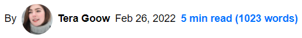

<p align="center">
    Svelte component to display an estimated reading time
</p>

---

[](https://www.npmjs.com/package/@untemps/solid-readotron)
[](https://github.com/untemps/solid-readotron/actions)
[](https://codecov.io/gh/untemps/solid-readotron)

## Demo

<p align="center">
    :red_circle:&nbsp;&nbsp;<big><a href="https://solid-readotron.vercel.app" target="_blank" rel="noopener">LIVE
    DEMO</a></big>&nbsp;:red_circle:
    <br/><br/>
    
</p>

## Installation

```bash
yarn add @untemps/solid-readotron
```

## Usage

### Basic usage

```html
<main>
	<Readotron selector=".text" />
	<section class="text">...</section>
</main>
```

### API

| Props      | Type               | Default           | Description                                                                                                                                                     |
| ---------- | ------------------ | ----------------- | --------------------------------------------------------------------------------------------------------------------------------------------------------------- |
| `selector` | string             | (required)        | Selector of the element which contains the content to parse. See [document.querySelector](https://developer.mozilla.org/fr/docs/Web/API/Document/querySelector) |
| `lang`     | string             | 'en'              | Lang of the content [""ar', 'zh', 'nl', 'en', 'fi', 'fr', 'de', 'he', 'it', 'ko', 'es', 'sv']                                                                   |
| `template` | string or function | '%time% min read' | Display template which contains dynamic tokens to be replaced by the parsed values. See [Template](#template)                                                   |

### Selector

`selector` prop is mandatory as it points to which element contains the text content to parse.
You can utilize any selector supported by the Web API [querySelector](https://developer.mozilla.org/fr/docs/Web/API/Document/querySelector) function.  
If several elements match the selector, it only parses the text of the first element in the array.

### Lang

'lang' is an optional prop that designates the language of the text to parse. The component implements the [@untemps/read-per-minute](https://github.com/untemps/read-per-minute) underhand package which returns an estimation based on the _lang_ (language).  
Reading rates by _lang_ come from ["How many words do we read per minute? A review and meta-analysis of reading rate"](https://osf.io/4nv9f/) by Marc Brysbaert - Department of Experimental Psychology Ghent University

| Lang    | Rate |
| ------- | ---- |
| default | 200  |
| ar      | 181  |
| zh      | 260  |
| nl      | 228  |
| en      | 236  |
| fi      | 195  |
| fr      | 214  |
| de      | 260  |
| he      | 224  |
| it      | 285  |
| ko      | 226  |
| es      | 278  |
| sv      | 218  |

If a lang is not defined or the provided lang is not listed, the **default** value (200) will be applied.

#### Example

```html
<main>
	<Readotron selector=".text" lang="en" />
	<section class="text">...</section>
</main>
```

### Template

You can customize the Readotron display by using the `template` prop: a template is a string with one or more tokens delimited with `%`

#### Available tokens

| Token   | Description                         |
| ------- | ----------------------------------- |
| `time`  | Estimated reading time (in minutes) |
| `words` | Number of words                     |

#### Example

```html
<main>
	<Readotron selector=".text" template="Reading Time: %time% minutes (%words% words)" />
	<section class="text">...</section>
</main>
```

### Children

Another way to customize the Readotron display is to pass down a function as children.

#### Available arguments

| Token   | Description                         |
| ------- | ----------------------------------- |
| `time`  | Estimated reading time (in minutes) |
| `words` | Number of words                     |
| `error` | Parsing error if available          |

#### Example

```html
<main>
    <Readotron selector=".text">
      {(time, words, error) => (
      <Show when={!error} fallback={<span class='error'>Oops</span>}>
        <span class='readotron'>
          {time} min read ({words} words)
        </span>
      </Show>``
      )}
    </Readotron>
    <section class="text">
        ...
    </section>
</main>
```

## Development

The component can be served for development purpose on `http://localhost:10001/` running:

```
yarn dev
```

## Contributing

Contributions are warmly welcomed:

-   Fork the repository
-   Create a feature branch
-   Develop the feature AND write the tests (or write the tests AND develop the feature)
-   Commit your changes
    using [Angular Git Commit Guidelines](https://github.com/angular/angular.js/blob/master/DEVELOPERS.md#-git-commit-guidelines)
-   Submit a Pull Request
